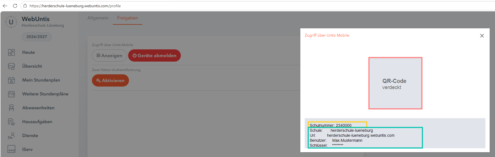
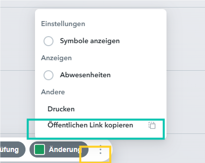

# WebUntis-Zugang einrichten

Diese Anleitung zeigt, wo Eltern die Angaben für den Schulplaner finden. Die Screenshots sind anonymisierte Musterbilder. QR-Code, Benutzername und Schlüssel sind entfernt oder ersetzt.

## 1. Bei WebUntis einloggen

Öffne WebUntis und melde dich mit deinem WebUntis- oder IServ-Zugang an.

## 2. Freigaben öffnen

Unten links auf den eigenen Namen klicken, oben `Freigaben` öffnen und bei `Zugriff über Untis Mobile` auf `Anzeigen` klicken.

Im grauen Kasten unter dem QR-Code stehen fast alle WebUntis-Angaben:

- `Schulnummer` = Schulnummer
- `Url` = WebUntis Server
- `Schule` = Schulname
- `Benutzer` = Benutzername
- `Schlüssel` = App-Schlüssel

## 3. Element-ID aus dem Stundenplan-Link kopieren

Öffne in WebUntis `Mein Stundenplan`. Unten über die drei Punkte `Öffentlichen Link kopieren` wählen.

Den kopierten Link danach kurz irgendwo einfügen, damit du ihn sehen kannst.

Die Zahl hinter `entityId=` kommt im Schulplaner in das Feld `Element-ID`.

## 4. Passwort

Das Passwort ist das eigene WebUntis-/IServ-Passwort und wird auch für den Login in diese App genutzt.

Wenn Passwort oder App-Schlüssel bereits gespeichert sind, zeigt das Feld `********`. Zum Ändern einfach den neuen Wert eintragen.

## Busfahrplan

Die Busfunktion nutzt deutschlandweite Nahverkehrs-Fahrplandaten, soweit die jeweilige Haltestelle und Verbindung im frei verfügbaren Deutschland-Fahrplandatensatz enthalten ist.

Es sind Sollfahrpläne, keine Live-Verspätungen. Weitere Anbieter, Regionen oder Echtzeitdaten können später ergänzt werden.
